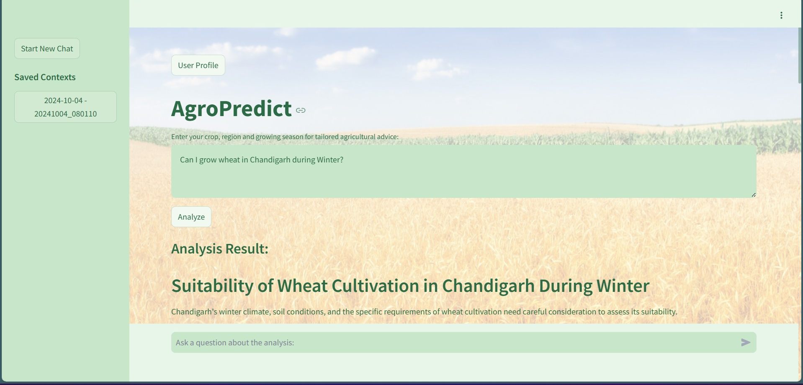

### AgroPredict: Deployment and Usage Guide

AgroPredict is an advanced AI-powered crop recommendation system designed to assist farmers in making informed decisions about crop selection based on various environmental and historical factors. This guide will walk you through the steps to deploy and use AgroPredict.



---

### Prerequisites

- Docker
- Google Cloud SDK
- Python 3.7+
- A Firebase project connected to the GCP project:
  - **Enable Email/Password Authentication**:
    - Go to the Firebase console.
    - Navigate to **Authentication > Sign-in Method**.
    - Enable the **Email/Password** sign-in provider.
  - **Set Up a Firebase Realtime Database** or **Firestore Database**:
    - Go to **Firestore Database** or **Realtime Database** in Firebase.
    - Create a database and configure its rules as required.

---

### Step 1: Clone the Repository

Clone the AgroPredict repository to your local machine:

```bash
git clone https://github.com/RavenWorks247/AgroPredict
cd AgroPredict
```

---

### Step 2: Set Up Google Cloud

1. **Create a Google Cloud Project:**

   - Go to the [Google Cloud Console](https://console.cloud.google.com/).
   - Create a new project.

2. **Enable APIs:**

   - Enable the Vertex AI API and Cloud Run API for your project.

3. **Set Up Authentication:**

   - Authenticate your Google Cloud SDK:
     ```bash
     gcloud auth login
     ```
   - Set your project ID:
     ```bash
     gcloud config set project YOUR_PROJECT_ID
     ```

---

### Step 3: Deploy AgroPredict

AgroPredict deployment is managed through a single shell script (`execall.sh`). Follow these steps:

1. **Navigate to the main directory:**

   ```bash
   cd Application
   ```

2. **Execute the deployment script:**

   ```bash
   sh execall.sh
   ```

The script performs the following actions:

#### Deploying `gemini-service`:

1. Builds and submits the Docker image to Google Container Registry:

   ```bash
   gcloud builds submit --tag gcr.io/PROJECT_ID/crop-analysis-app
   ```

2. Deploys the container to Cloud Run:

   ```bash
   gcloud run deploy crop-analysis-app \
     --image gcr.io/PROJECT_ID/crop-analysis-app \
     --region ENTER_REGION \
     --memory 16Gi \
     --cpu 4 \
     --platform managed \
     --allow-unauthenticated
   ```

#### Deploying `streamlit-crop-app`:

1. Builds and pushes the Docker image to Google Container Registry:

   ```bash
   docker build -t gcr.io/PROJECT_ID/streamlit-crop-app .
   docker push gcr.io/PROJECT_ID/streamlit-crop-app
   ```

2. Deploys the container to Cloud Run:

   ```bash
   gcloud run deploy streamlit-crop-app \
     --image gcr.io/PROJECT_ID/streamlit-crop-app \
     --platform managed \
     --region ENTER_REGION \
     --memory 4Gi \
     --cpu 2 \
     --allow-unauthenticated
   ```

---

### Step 4: Using AgroPredict

AgroPredict provides an intuitive web-based interface for interacting with its services. Access the deployed application via the provided URL from Cloud Run, and explore features such as crop suitability analysis and contextual insights about crop growth.

#### Features:

1. **Crop Suitability Analysis:**

   - Evaluate the potential for growing specific crops in a given region and season.

2. **Contextual Insights:**

   - Obtain detailed and tailored recommendations for agricultural planning.

Simply navigate to the URL of the deployed `streamlit-crop-app` to get started.

---

### Project Structure

```
Application/
├── gemini-service/
│   ├── .env
│   ├── BuildAndDeploy.txt
│   ├── Dockerfile
│   ├── main.py
│   ├── requirements.txt
├── streamlit-crop-app/
│   ├── .streamlit/
│   │   ├── config.toml
│   ├── .env
│   ├── Dockerfile
│   ├── app.py
│   ├── guidefile.txt
│   ├── requirements.txt
├── execall.sh
```

---

### Technical Details

- **NLP Model**: Utilizes Hugging Face Transformers for NLP tasks.
- **Vertex AI**: Interacts with Vertex AI's Gemini model for detailed analysis.
- **Redis**: Used for caching session contexts to maintain state across requests.
- **Streamlit**: Provides an interactive web interface for users.
- **Flask**: The web framework used to build the application.
- **Gunicorn**: The WSGI server used to run the Flask application in production.

---

### Conclusion

AgroPredict leverages advanced AI technology to provide precise and actionable insights for farmers. By following this guide, you can deploy AgroPredict on Google Cloud Platform and start making AI-driven decisions in agriculture. Embrace the future of farming with AgroPredict!

For any issues or contributions, feel free to open an issue or a pull request here.

